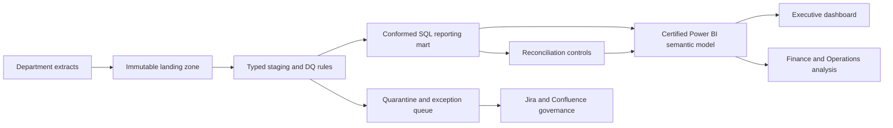

# Enterprise Reporting Governance and Modernization

> Business analysis and BI delivery project for transforming fragmented spreadsheet reporting into a governed, reconciled, and decision-ready reporting product.

## Executive summary

Finance and Operations teams were relying on department-owned spreadsheets with inconsistent grains, duplicate records, conflicting KPI definitions, manual reconciliations, and delayed executive reporting. This project designs a controlled future state: immutable source landing, automated validation and survivorship, a conformed SQL reporting mart, a certified Power BI semantic model, and a traceable UAT and governance operating model.

The repository documents the complete analysis, design, validation, and implementation approach, including requirements, data controls, reporting logic, UAT evidence, and operational governance.

## Business outcome

| Measure | Baseline | Target state |
|---|---:|---:|
| Monthly reporting cycle | 5 business days | ≤2 business days |
| Manual touchpoints | 14 | ≤4 |
| Unreconciled variance | 2.8% | ≤0.5% and ≤$1,000 |
| Duplicate rate | 1.9% | <0.1% |
| Illustrative annual capacity value | — | $69,420 |

## Key findings and recommendations

The primary issue is not limited to manual reporting effort. Decision-makers are using metrics with inconsistent definitions, grains, date logic, and ownership. Sales reports bookings as “sales,” Finance reports posted invoices as “sales,” and Operations measures delivery at a different grain. The target operating model establishes one named KPI, one accountable owner, one reporting grain, one governing date, and one approved calculation for each certified measure.

The UAT results support the following management conclusions:

- **15 of 18 tests pass**, showing that the KPI logic, duplicate handling, reconciliation, drill-through, accessibility, and performance design are working as intended.
- **2 tests are blocked by regional security-role provisioning**, so the report should not be certified for broad distribution yet. This is a governance decision, not a cosmetic defect.
- **1 refresh-SLA test remains pending**, which means the production-like schedule still needs evidence before the close process can be retired.
- **March shows a quality warning signal**: landed volume increases while missing mandatory fields, duplicate rows, and unmapped aliases rise materially. The correct response is to investigate the source submission and mapping backlog—not to hide the records or silently treat them as zero.
- **The benefits model estimates 1,068 hours of annual capacity released**, equivalent to approximately $69,420 at the stated blended rate. This represents capacity value and should be validated through post-implementation time studies.

### Executive interpretation

The recommended decision is **proceed to controlled pilot, while withholding enterprise certification until the RLS and refresh controls pass**. The solution addresses reporting consistency and cycle-time requirements; the remaining acceptance criteria are security, refresh timeliness, and operational ownership. These conditions are reflected in the dashboard certification banner, UAT gate, defect log, reconciliation controls, and implementation roadmap.

## What this repository demonstrates

- Requirements elicitation and stakeholder interviewing
- Current-state and future-state process mapping
- KPI conflict resolution and metric governance
- Source-to-target data mapping and effective-dated reference data
- SQL survivorship, conformed joins, reconciliation, and certification controls
- Data-quality profiling, statistical anomaly detection, and quarantine design
- Power BI semantic-model design, DAX measures, RLS, drill-through, and performance requirements
- User stories, acceptance criteria, traceability, UAT execution, defect management, and sign-off
- Benefits realization, risk management, RACI, change governance, and implementation roadmap

## Repository map

| Path | Purpose |
|---|---|
| `deliverables/Enterprise_Reporting_Modernization_Requirements_Pack.docx` | Full BA requirements and solution-design pack |
| `deliverables/Enterprise_Reporting_UAT_Workbook.xlsx` | UAT dashboard, test cases, reconciliation, quality analysis, traceability, benefits model, defects, and sign-off |
| `sql/reporting_mart.sql` | SQL pattern for de-duplication, conformed mapping, fact construction, and ledger reconciliation |
| `powerbi/measures.dax` | Certified Power BI measures and certification logic |
| `powerbi/PowerBI_Dashboard_Wireframe.html` | Browser-viewable dashboard wireframe for report-page validation |
| `powerbi/README.md` | Semantic model, page design, security, refresh, and implementation handoff |

## Architecture

```text
Department extracts
        ↓
Immutable landing + manifest + checksum
        ↓
Typed staging + row-level data-quality results
        ↓
Conformed SQL mart + effective-dated dimensions
        ↓
Certified Power BI semantic model + DAX measures
        ↓
Executive, Finance, Operations, and Data Quality pages
        ↓
UAT evidence, reconciliation controls, and governed release
```

### Solution architecture visual



### Dashboard visual

The repository includes a browser-viewable [Power BI dashboard wireframe](powerbi/PowerBI_Dashboard_Wireframe.html) showing KPI cards, filters, trend analysis, certification status, and action items.

## KPI governance model

The solution explicitly separates metrics that were previously conflated:

- **Gross Bookings**: accepted order value by order date.
- **Gross Revenue**: posted invoice value before discounts, returns, and tax.
- **Net Revenue**: gross revenue less discounts and approved credits by invoice date.
- **On-Time Delivery**: delivered order lines where actual delivery date is on or before promised date.
- **Fill Rate**: capped shipped quantity divided by ordered quantity.

Every certified KPI has a business owner, calculation, grain, governing date, filters, exclusions, effective date, and test coverage.

## Quality and UAT approach

The workbook contains 18 UAT scenarios covering KPI calculation, duplicate survivorship, effective-dated mappings, reconciliation tolerance, filter behavior, drill-through lineage, refresh SLA, RLS, accessibility, and performance. It also includes deterministic data-quality thresholds, rolling quality-rate monitoring, a revenue z-score signal, source-to-dashboard reconciliation controls, bidirectional requirements traceability, defect management, and benefits realization.

## How to review the project

1. Start with the requirements pack to understand the problem, stakeholders, operating model, and target architecture.
2. Open the UAT workbook and review the `UAT Summary`, `Quality Analysis`, `Traceability`, and `Benefits Case` tabs.
3. Read the SQL and DAX files together to connect source transformations to certified reporting measures.
4. Open the dashboard wireframe to see the proposed executive experience.

## Important implementation note

The repository contains the Power BI design handoff, DAX, SQL, sample logic, and dashboard wireframe. A binary `.pbix` is not included because credentials, tenant configuration, and publication settings are environment-specific. The model is ready to bind in Power BI Desktop and validate against the UAT workbook.

## Author positioning

This project demonstrates end-to-end delivery capabilities for Data Business Analyst, BI Business Analyst, Reporting Business Analyst, and Analytics Consultant roles, including requirements analysis, data modeling, KPI governance, SQL transformation, Power BI design, UAT, and implementation planning.

## License

Portfolio project. Data and business context are controlled project artifacts and do not contain confidential production information.

